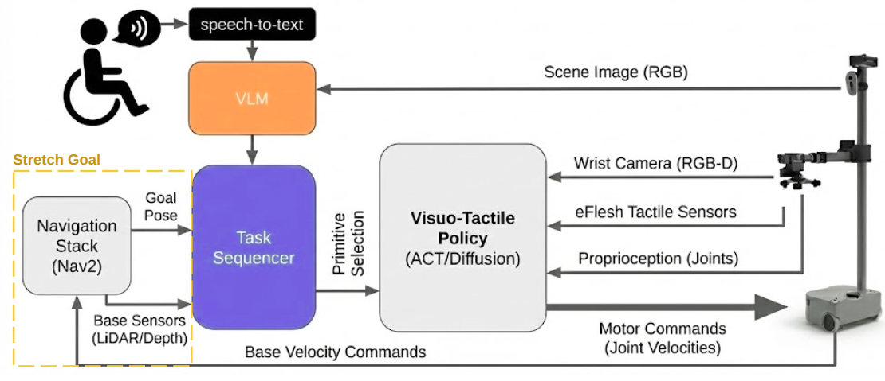
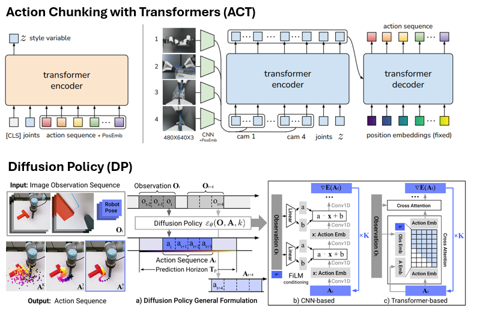

# Visuo-Tactile Assistive Manipulation

VTAM is a UMI-style imitation learning platform for the Hello Robot Stretch 3. It records teleoperated demonstrations with synchronized RGB, depth, joint, and tactile (eFlesh) sensor data, then trains and deploys learned manipulation policies.





## System Overview

```
Record (robot)   Chunk      Process      Train      Infer (robot + GPU)
MCAP bags        episodes   HF dataset   policy     ZMQ pipeline
```

| Stage | Tool | Output |
|-------|------|--------|
| Record | `ros2 launch vtam_core vtam.launch.py` | `data/raw/<task>/session_*.mcap` |
| Chunk | `bag_chunker.py` | `data/processed/<task>/episode_*.mcap` |
| Process | `process_demo.py` | `data/lerobot/<task>/` (HuggingFace) |
| Train | `lerobot/scripts/train.py` | `outputs/train/*/checkpoints/` |
| Infer | `server_inference.py` + `robot_inference.py` + `run.py` | live robot control |

## Action Space (8D)

| Field | Dim | Description |
|-------|-----|-------------|
| `x, y, z` | 3 | EE position in robot canonical frame (metres) |
| `qx, qy, qz, qw` | 4 | EE orientation as XYZW quaternion |
| `gripper` | 1 | Normalised gripper width [0, 1] |

Actions are stored as relative deltas so the policy is invariant to robot starting configuration.
